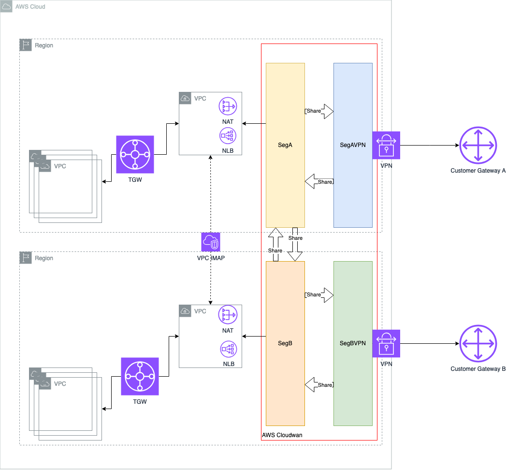

# TerrAWAN - Multi-Region Affiliate Network Infrastructure

## ⚠️ Important Disclaimer

**This project is for testing and demonstration purposes only.**

Please be aware of the following:

- The infrastructure deployed by this project is not intended for production use.
- Security measures may not be comprehensive or up to date.
- Performance and reliability have not been thoroughly tested at scale.
- The project may not comply with all best practices or organizational standards.

Before using any part of this project in a production environment:

1. Thoroughly review and understand all code and configurations.
2. Conduct a comprehensive security audit.
3. Test extensively in a safe, isolated environment.
4. Adapt and modify the code to meet your specific requirements and security standards.
5. Ensure compliance with your organization's policies and any relevant regulations.

The maintainers of this project are not responsible for any issues that may arise from the use of this code in production environments.

---


## Project Overview

TerrAWAN is a Terraform project designed to create a sophisticated multi-region network infrastructure on AWS. It's specifically tailored for organizations managing multiple affiliates across various geographical locations, addressing challenges such as IP overlap and per-affiliate cost management.

## Key Features

- Multi-region network connectivity using AWS Cloud WAN
- IP overlap management with AWS IPAM
- Segmented VPCs for affiliate isolation
- Secure connectivity with VPN integration
- Cost allocation and management per affiliate
- Scalable and modular architecture

## Architecture Overview



TerrAWAN builds a centralized network architecture that connects affiliates across several regions:

1. **Core Network (AWS Cloud WAN)**: Acts as the backbone, providing centralized control and connectivity across all regions and segments.
2. **IP Address Management (IPAM)**: Manages IP allocations across the entire network, preventing conflicts and overlaps.
3. **Segmented VPCs**: Each affiliate or business unit gets dedicated VPC resources, isolated from others.
4. **VPN Connections**: Secure remote access and on-premises network integration.
5. **Multi-Region Support**: Spans multiple AWS regions for global coverage and reduced latency.

### Key Benefits

- **IP Overlap Handling**: Manages conflicting IP ranges from different affiliates.
- **Cost Management**: Enables tracking and allocation of costs per affiliate.
- **Scalability**: Easily add new affiliates or expand into new regions.
- **Centralized Control**: Simplifies management of complex, distributed networks.
- **Enhanced Security**: Implement consistent policies across the entire network.

## Prerequisites

- Terraform installed (version X.X or later)
- AWS CLI configured with appropriate credentials
- Basic understanding of AWS networking concepts and Terraform

## Project Structure

The project is organized into several modules:

- `corenetwork`: Sets up the AWS Cloud WAN core network
- `ipam`: Configures IP Address Management
- `templateaffiliatevpc`: Creates VPCs for different segments
- `vpn`: Sets up VPN connections

## Usage

1. Clone the repository
2. Navigate to the project directory
3. Initialize Terraform:
```
terraform init
```
4. Review and modify the `variables.tf` file as needed
5. Plan the Terraform execution:
```
terraform plan
```
6. Apply the Terraform configuration:
```
terraform apply
```

## Configuration

The main configuration is done in the `main.tf` file. You can customize the following:

- AWS region
- Network segments (SegA, SegB)
- VPN configurations
- CIDR blocks for exchange networks

## Modules

### Core Network
Creates the central AWS Cloud WAN network.

### IPAM
Sets up IP Address Management for efficient IP allocation.

### Template Affiliate VPC
Creates VPCs for different segments, connecting them to the core network.

### VPN
Establishes VPN connections for secure remote access.

## Contributing

Contributions to improve TerrAWAN are welcome. Please follow these steps:

1. Fork the repository
2. Create a new branch
3. Make your changes
4. Submit a pull request

## License

This project is licensed under the terms of the MIT license. See the [LICENSE](LICENSE) file for details.

## Support

For questions or issues, please open an issue in the GitHub repository.
